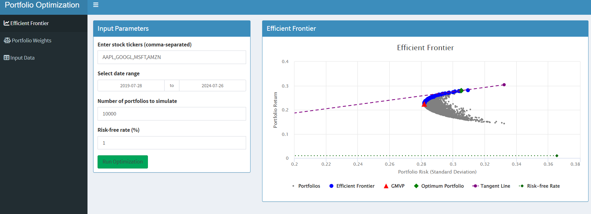

# Portfolio Optimization Shiny App




This Shiny application allows users to perform portfolio optimization by simulating multiple portfolios and visualizing the efficient frontier. Users can input stock tickers, select a date range, specify the number of portfolios to simulate, and set a risk-free rate. The application will then display the efficient frontier, including the Global Minimum Variance Portfolio (GMVP) and the optimum portfolio based on the Sharpe Ratio.

## Features

- Input stock tickers and date range for analysis
- Specify the number of portfolios to simulate and the risk-free rate
- Visualize the efficient frontier with the GMVP and optimum portfolio
- Display portfolio weights for the optimum portfolio and GMVP
- Show key metrics for both the optimum portfolio and GMVP
- View historical stock returns used for the analysis

## Libraries Used

- `shiny`: For creating the interactive web application
- `quantmod`: For retrieving stock data
- `PortfolioAnalytics`: For portfolio optimization
- `ROI` and `ROI.plugin.quadprog`: For solving optimization problems
- `highcharter`: For interactive charting
- `shinydashboard`: For creating the dashboard layout
- `DT`: For rendering data tables

## Installation

To run this application, you need to have R and the required libraries installed. You can install the necessary libraries using the following commands:

```R
install.packages(c("shiny", "quantmod", "PortfolioAnalytics", "ROI", "ROI.plugin.quadprog", "highcharter", "shinydashboard", "DT"))
```

## Usage

1. Clone or download this repository to your local machine.
2. Open the project directory and run the `app.R` file using RStudio or from the R console:

```R
shiny::runApp("path/to/app.R")
```

3. The application will open in your default web browser.

## Application Structure

- **UI**: The user interface is created using `shinydashboard` with three main tabs:
  - Efficient Frontier
  - Portfolio Weights
  - Input Data

- **Server**: The server logic handles data retrieval, processing, portfolio simulation, and visualization.

## Functions

### `plot_efficient_frontier_highcharter`

This function plots the efficient frontier using `highcharter`.

### Reactive Expressions

- `stock_data`: Retrieves stock data based on user input.
- `returns`: Calculates the returns from the stock data.

### `generate_portfolios`

This function generates random portfolios and calculates their returns, risks, and Sharpe Ratios.

### Event Reactives and Render Functions

- `portfolios_data`: Generates portfolios when the user clicks the "Run Optimization" button.
- `output$efficient_frontier_plot`: Plots the efficient frontier.
- `output$weights_table`: Renders the table of weights for the optimum portfolio.
- `output$gmvp_weights_table`: Renders the table of weights for the GMVP.
- `output$optimum_metrics`: Displays metrics for the optimum portfolio.
- `output$gmvp_metrics`: Displays metrics for the GMVP.
- `output$returns_table`: Renders the table of historical stock returns.

## License

This project is licensed under the MIT License. See the [LICENSE](LICENSE) file for details.

## Acknowledgments

- This application uses data from Yahoo Finance.
- The `quantmod` and `PortfolioAnalytics` packages are essential for financial data retrieval and portfolio optimization.

Feel free to contribute to this project by forking the repository and submitting pull requests. For any issues or suggestions, please open an issue on the GitHub repository.
